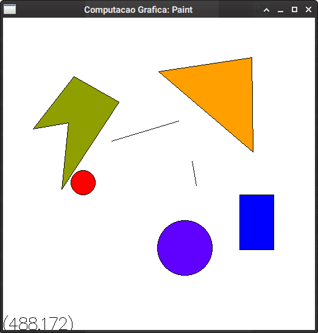

# Paint 2D

Esta aplicação busca atender as especificações do trabalho da disciplina
de Computação Gráfica (DC/CCN032) da [Universidade Federal do Piauí](https://ufpi.br).

O código original está disponível [aqui](https://github.com/rfsousa/Paint2D).

Trata-se de um editor gráfico utilizando as bibliotecas OpenGL e GLUT. 
É limitado ao uso de pontos para formar os desenhos, utilizando algoritmos
de rasterização de retas e polígonos.

## Como construir

Em um ambiente baseado em Arch Linux, basta instalar os pacotes `gcc` e 
`freeglut`.

`# pacman -Sy gcc freeglut`

Em seguida, basta clonar este repositório:

`$ git clone https://github.com/rfsousa/Paint2D.git && cd Paint2D`

Então, basta compilar o projeto:

`$ make`

Será criado um arquivo executável chamado `main` na pasta `bin`.

Deve ser possível executar este projeto em qualquer ambiente que 
tenha o GLUT instalado e um compilador de C++11 disponível.

## Recursos

- Desenhar linhas, retângulos, polígonos e circunferências, basta
utilizar o botão direito do mouse para escolher a função.
- É possível preencher regiões utilizando a função 'Preencher', que 
utiliza uma cor definida usando as teclas R, G e B (segurando shift aumenta 
a intensidade de cada canal de cor).
- As teclas O e P devem permitir as transformações de escala nos eixos x 
e y, respectivamente.
- A tecla Z realiza a transformação de rotação.
- As teclas X e Y podem realizar transformação de cisalhamento.
- A tecla M pode realizar reflexão, utilizando uma transformação de escala 
(multiplicando uma das coordenadas por -1).
- As transformações que dependem de uma translação para a origem funcionam 
corretamente, já que é realizado o cálculo do centróide da figura utilizando 
geometria analítica.
- O uso da tecla shift é intuitivo e pode ser combinado com as teclas que 
realizam transformações geométricas para realizar a transformação em um 
sentido ou eixo diferente.
- As setas do teclado permitem a translação da última figura.
- Todas as transformações somente são possíveis com a última figura.
- É possível limpar o desenho, destruindo as formas e preenchimentos com 
a função "Limpar".
- Houve a tentativa de evitar vazamentos de memória sempre que possível, 
de forma a evitar problemas de desempenho.

